# Secure Multi-Tenant Task Management System

A **secure, API-first, multi-tenant task management system** built using **Django & Django REST Framework**, implementing **role-based access control (RBAC)**, **company-level isolation**, and **API abuse prevention**.

This system allows multiple companies to manage tasks independently, where **Managers assign tasks to Reportees** with strict backend-enforced permissions.

---

##  Objective

- Build a secure multi-tenant backend
- Enforce role-based access (Manager / Reportee)
- Implement JWT authentication
- Prevent API abuse using rate limiting
- Ensure strict company-level data isolation

---

##  Tech Stack

- **Backend:** Python, Django, Django REST Framework  
- **Authentication:** JWT (SimpleJWT)  
- **Database:** SQLite  
- **Security:** RBAC, API Throttling  
- **Testing:** Postman  

---

##  User Roles

###  Manager
- Sign up and log in
- Create reportee accounts
- Create and assign tasks
- Update task status at any stage
- View all tasks in their company

###  Reportee
- Log in using manager-created credentials
- View only assigned tasks
- Update task status **only to COMPLETED**
- No permission to create users or tasks

---

##  Data Models

### Company
- `name`

### User
- `username`
- `password` (hashed)
- `role` (MANAGER / REPORTEE)
- `company`
- `created_at`

### Task
- `title`
- `description`
- `status` (DEV / TEST / STUCK / COMP)
- `categories`
- `assigned_to`
- `created_by`
- `company`
- `created_at`

---

##  Authentication & Authorization

- JWT-based authentication
- Token required for all protected APIs
- Expired or invalid tokens are rejected
- Proper HTTP status codes (`401`, `403`)

---

##  Application Flow (API-First)

### Manager Flow
1. Manager signs up and creates a company
2. Logs in and receives JWT token
3. Creates reportees
4. Creates & assigns tasks
5. Updates task status at any stage

### Reportee Flow
1. Logs in using manager-provided credentials
2. Views only assigned tasks
3. Updates task status **only to COMPLETED**

> All permissions are enforced at the **API level**, not UI.

---

##  Security & Abuse Prevention

### Role-Based Access Control (RBAC)
- Managers and reportees have different permissions
- Unauthorized actions return **403 Forbidden**

### Multi-Tenant Isolation
- All users and tasks belong to a company
- Queries filtered by `company_id`
- No cross-company data leakage

### API Rate Limiting
- Login and sensitive APIs are throttled
- Excess requests return **429 Too Many Requests**

### Token Expiration
- Expired JWT tokens are rejected automatically

---

##  API Testing (Postman)

### Manager Signup
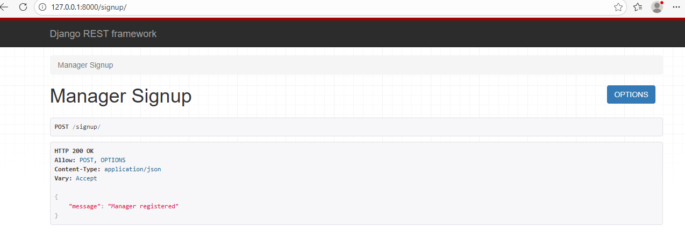

### Manager Login & JWT Token
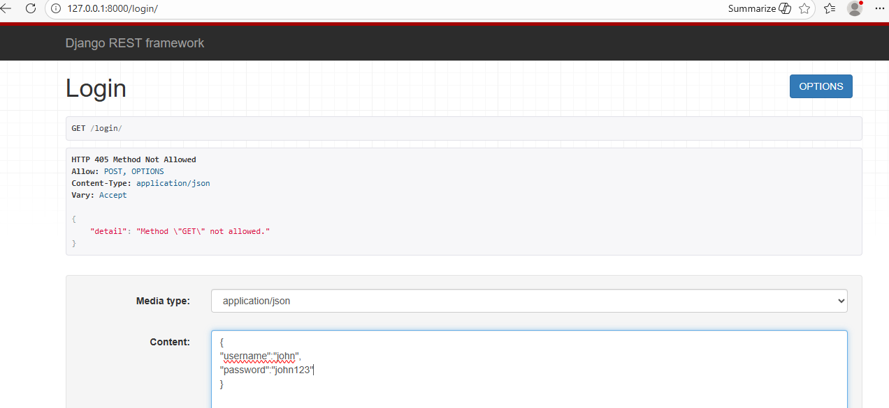  
.png)

### Reportee Creation (by Manager)
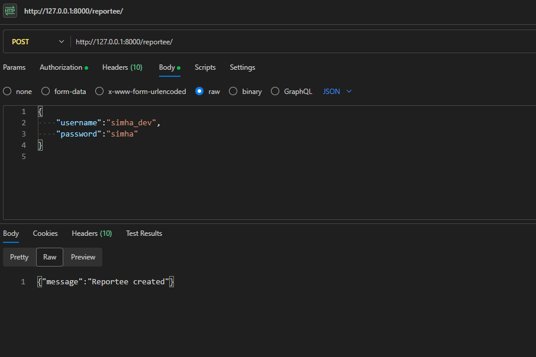

### Task Creation (by Manager)
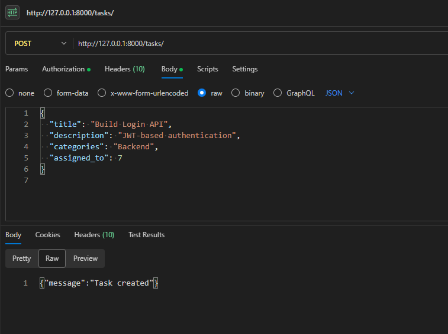

### Tasks UI / Task Listing
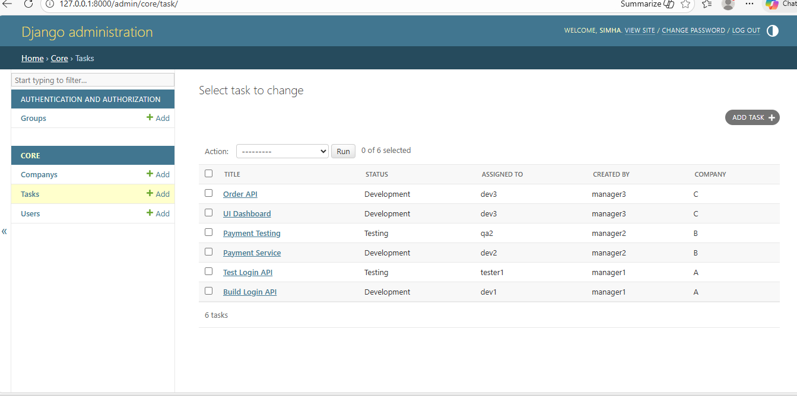

### Reportee Login
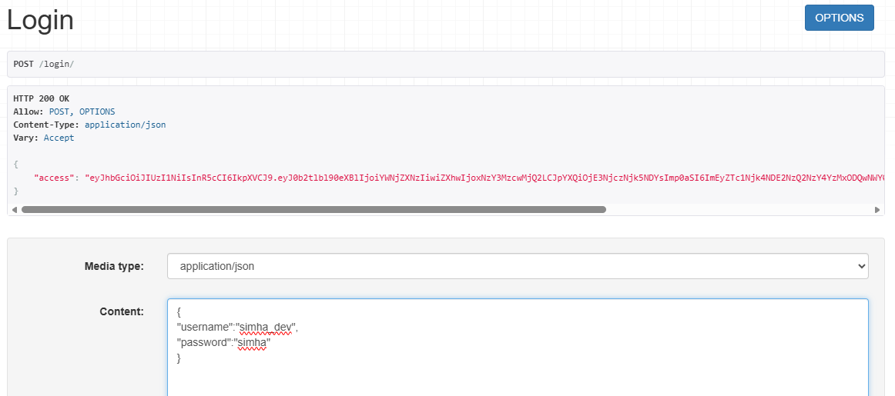

### Reportee Task List (Only Assigned Tasks)
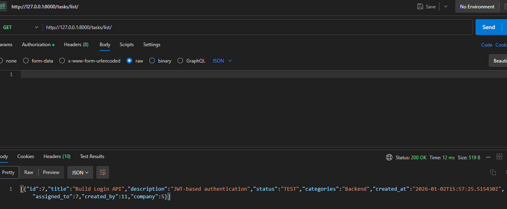

### Reportee Updates Task Status (COMPLETED)
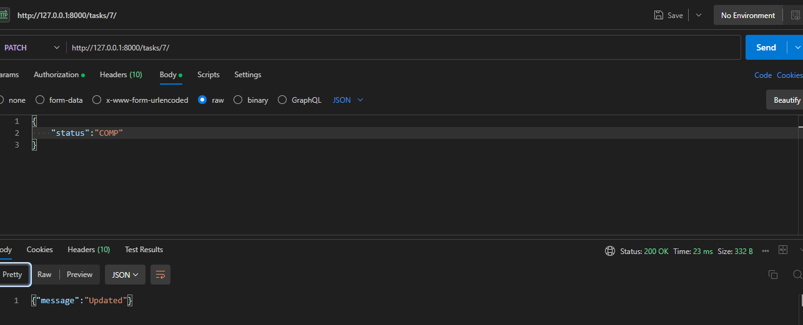

### Task Status Updated (Verification)
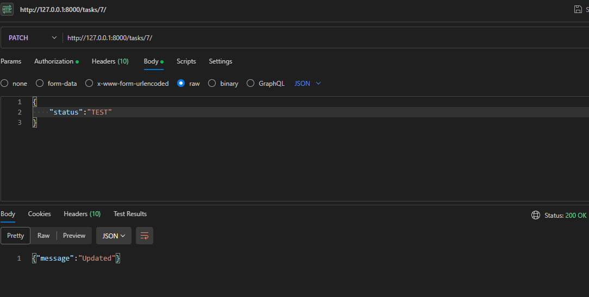

### API Rate Limiting (429 Too Many Requests)
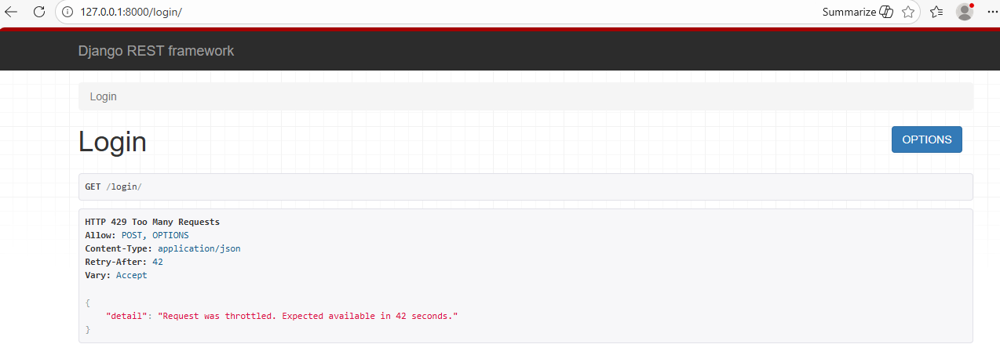

### JWT Token Expiration Handling
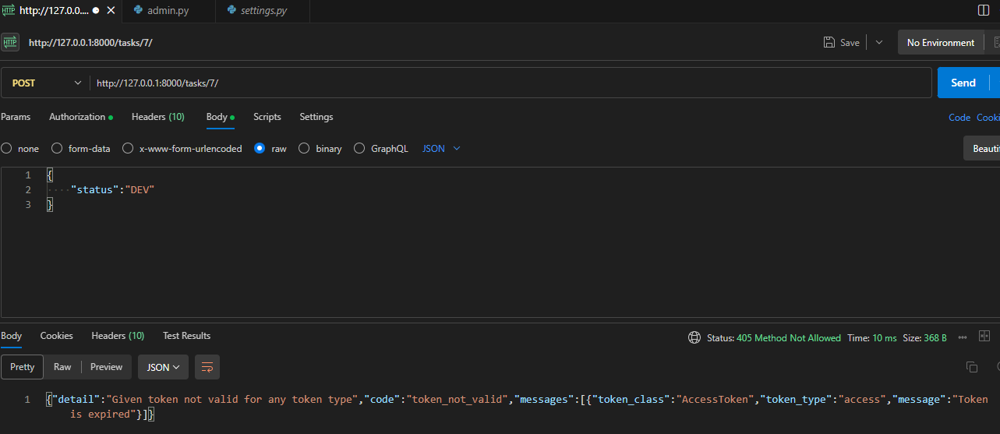

---

## Django Admin (Verification Only)

- Used only for internal verification
- Confirms persistence of API-created data
- Not used as application UI

---

##  Setup Instructions

```bash
git clone https://github.com/<your-username>/Secure-MultiTenant-Task-Management.git
cd Secure-MultiTenant-Task-Management

python -m venv venv
venv\Scripts\activate

pip install -r requirements.txt

python manage.py migrate
python manage.py runserver
